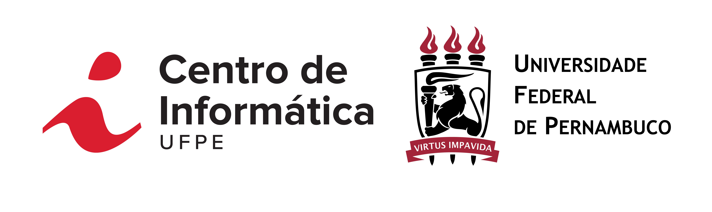

### [PROJETO DA DISCIPLINA APRENDIZAGEM DE MÁQUINA ](https://github.com/marcosd3souza/ml-cin-2021)

<kbd></kbd><br>

```txt
UNIVERSIDADE FEDERAL DE PERNAMBUCO - UFPE
CENTRO DE INFORMÁTICA - CIn
PROGRAMA DE PÓS-GRADUAÇÃO EM CIÊNCIA DA COMPUTAÇÃO
RECIFE-PE, AGOSTO DE 2021

PROFESSOR: Francisco de Assis Teixeira de Carvalho 
EQUIPE: Carlos Antônio Alves Júnior (caaj@cin.ufpe.br)
        Marcos de Souza Oliveira (mso2@cin.ufpe.br)
        Matheus Johann Araújo (mja@cin.ufpe.br)
```

<hr>

#### [PROJETO DE APRENDIZAGEM DE MÁQUINA](./projeto-proposto.pdf)

> ##### [PDF do Relatório](./relatorio-am-projeto-l.pdf)

> ##### [PDF da Apresentação](./slides-projeto-am.pdf)

<hr>

#### REQUERIMENTOS:

> ##### [Python: `>= 3.7`](https://www.python.org)

> ##### Dependências utilizadas:
```txt
# Precisa instalar:
sklearn (scikit-learn),
parameters,
numpy,
pandas

# Nativo do Python
sys,
math,
statistics,
collections,
csv,
time
```

<hr>

#### EXECUTANDO A APLICAÇÃO:

> ##### Abra um terminal dentro da pasta `code/`;

> ##### Para executar o código do projeto insira o comando `python main.py`.
